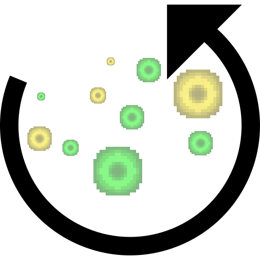

# RetainXP

**NOTE: This project has been previously called "XPKeeper" but has been renamed to RetainXP as there already exists [another project](https://www.curseforge.com/minecraft/bukkit-plugins/xpkeeper) with the same name.**

A Minecraft Bukkit plugin which prevents loosing all your XP after death.

## What is it?

Are you annoyed to lose all your XP just because you didn't heard a Creeper behind you?

RetainXP allows you to keep a part of your XP after you die. For example, you can configure it to keep 50% of your XP on death instead of losing all of it.

## Permissions

Currently, there is only one permission available: `retainxp.retain` (Default: everyone)

## How does it work?

On player death (and if the player has the `retainxp.retain` permission) the current XP level is multiplied with the `multiplier` value specified in the [config.yml](src/main/resources/config.yml) file (which defaults to 1.0). On respawn, the new player level will be the calculated value.

Examples:

* If the multiplier is set to 1.0 and you die on XP level 60, you will be respawned with XP level 60.
* If the multiplier is set to 0.5 and you die on XP level 60, you will be respawned with XP level 30.

## Build

You can build the project in the following 2 steps:

 * Check out the repository
 * Build the jar file using maven: *mvn clean package*

**Note:** JDK 1.8 and Maven is required to build the project!

## My other plugins

You can find them on [my website](https://selfcoders.com/projects/minecraft-plugins).
